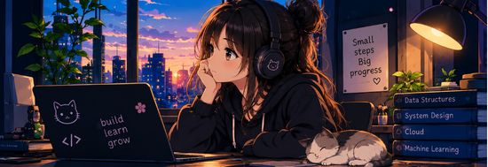
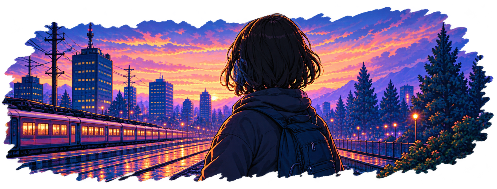

<div align="center">



</div>

<h1 align="center">Hi, I'm a Learner</h1>

<p align="center">

</p>

<p align="center">


</p>

<p align="center">
<a href="https://github.com/Haripriyagupta"></a>

</p>

---

### whoami


```

  name                  : Haripriya Gupta
  focus                 : [ Data Structure and Algorithms, Full Stack Development ]
  languages             : [C++, Python, Javascript]
  Currently learning    : System Design, Backend Development, AI/ML
  status                :  shipping code, one commit at a time
```


---

### `</>` Tech Stack

**Languages**
<br/>


**Web & Frameworks**
<br/>


**Databases**
<br/>


**Tools & Cloud**
<br/>


<br clear="right"/>

---

### 💡 Currently Learning


- DSA
- System Design
- Backend Development
- AI / ML

<br clear="right"/>

---

### 📊 GitHub Stats


<br clear="right"/>

---

### 🎯 Goals


- To live
- To focus
- To Enjoy
- To have self and skill development
- To Do some meaningful contributions and build for a impactful change.

<br clear="right"/>

---

### 🔥 Streak Stats

<div align="center">

</div>

---

### 📈 Contribution Graph

<div align="center">

</div>

---

### 🗓️ Contribution Heatmap

<div align="center">

</div>

---

<div align="center">



**Let's build something great together** 🌸

</div>

<!--
console.log("Thanks for stopping by — let's build something together.");
-->
